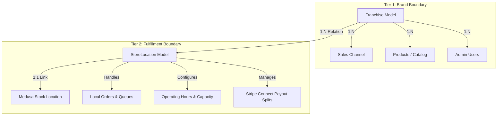

# Project Context: My Franchise Platform

Welcome to **My Franchise Platform**, a production-ready, multi-tenant e-commerce system optimized for bakery and confectionery brands (e.g., Cake Break, AMR). The system is built using a modern decoupled architecture powered by **MedusaJS v2** (backend) and **Next.js** (storefront), organized within a Turborepo-managed monorepo.

---

## 1. System Architecture & Multi-Tenancy

The platform implements a strict **Two-Tier State Isolation model** to separate brand identity and high-level catalogs from local physical store operations and fulfillment.



### Tier 1: Franchise-Level Isolation (Brand Boundary)
*   **Definition**: A `Franchise` is an abstract brand boundary (e.g., "Cake Break"), **not** a physical bakery.
*   **Responsibilities**:
    *   Defines the public brand name and unique route slug (`code`, e.g., `cakebreak`, `amr`).
    *   Acts as the parent catalog boundary. Products, variants, and collections are linked to the franchise.
    *   Mapped to one or more Medusa **Sales Channels** (`franchise_sales_channel` link table) to native-scope catalog queries.
    *   Associated with admin users (`franchise_user` link table) for tenant-scoped operations.

### Tier 2: Store-Level Isolation (Fulfillment Boundary)
*   **Definition**: A `StoreLocation` represents a physical bakery branch (e.g., "Cake Break – Koramangala") belonging to a franchise.
*   **Responsibilities**:
    *   Maintains geographic and physical coordinates (`latitude`, `longitude`, `address`).
    *   Manages operational states (`is_active`, `is_accepting_orders`, `custom_lead_time_hours`).
    *   Controls capacity metrics (`daily_order_capacity`, operating/pickup hours).
    *   Links directly to a Medusa **Stock Location** (`store_location_stock_location` link table) to track real-time stock levels per branch.
    *   Handles checkout routing and payouts via Stripe Connect account mappings.

### Current Operating Scale & Ownership Invariants

> **Read before changing franchise/product scoping.**

*   **Current scale**: The platform runs a **single live franchise (Cake Break)**. "Multiple stores" are modeled as `StoreLocation` rows **under** that franchise — so the multi-tenancy exercised today is at the **store/fulfillment layer (Tier 2)**, not the franchise layer (Tier 1). The Tier 1 machinery exists for when additional franchises are onboarded.
*   **Franchise → Product is strictly one-to-many**: every product belongs to **exactly ONE** franchise, forever. Franchises **never share products or inventory** — each future franchise gets an entirely separate catalog and stock. Onboarding a franchise means adding its own products, not sharing existing ones.
*   **Consequences (do not violate)**:
    *   Keep `src/links/franchise-product.ts` **one-to-many** (only the franchise side is `isList: true`). A many-to-many link would *permit* an invalid state (a product owned by two franchises) that the domain forbids — it was tried and reverted.
    *   The `franchise-product` link table is the **single source of truth** for product ownership. There is **no** `metadata.franchise_ids` fallback array — it was speculative multi-franchise code and has been removed. Do not reintroduce it.
    *   Product scoping reads resolve ownership from the link table only (a single indexed query), never by scanning the `product` table's metadata.

---

## 2. Monorepo Directory Layout

The workspace is organized as follows:

```
my-franchise-platform/
├── apps/
│   ├── backend/                     # MedusaJS v2 Backend Application
│   │   ├── src/
│   │   │   ├── api/                 # Custom store & admin endpoints
│   │   │   │   └── store/
│   │   │   │       ├── cart-inventory-check/
│   │   │   │       └── franchise-catalog/
│   │   │   ├── links/               # Medusa Link Engine schemas
│   │   │   ├── modules/             # Custom models & services
│   │   │   │   └── franchise/       # Franchise & StoreLocation models
│   │   │   └── utils/               # Multi-tenant helpers (TenantRequest)
│   │   └── medusa-config.ts         # Medusa server configuration
│   │
│   ├── web/                         # Next.js v14 Storefront (Next App Router)
│   │   ├── app/                     # Page components & dynamic routes
│   │   │   ├── cake-catalogue/
│   │   │   ├── cart/
│   │   │   └── map-routing/
│   │   └── src/
│   │       └── lib/
│   │           └── cart/            # Cart context & actions
│   │
│   └── backend/cake-project/        # Experimental Next.js v16 app workspace
│
├── designs/                         # Assets and Style Specs
│   └── stitch_remix_of_bakery...    # Modern Confectionery design system
└── package.json                     # Monorepo configuration
```

---

## 3. Database Schema & Link Engine

### Custom DML Models (`apps/backend/src/modules/franchise/models/`)
1.  **`Franchise`**:
    *   `id`: Primary key with `fran_` prefix.
    *   `name`: Brand name.
    *   `code`: Unique text slug (e.g., `amr`, `cakebreak`).
    *   `is_active`: Kill-switch. If false, all branches are offline.
    *   `metadata`: JSON bag (`brand_color`, `logo_url`, `contact_email`).
2.  **`StoreLocation`**:
    *   `id`: Primary key with `stloc_` prefix.
    *   `name` & `code`: e.g., "Cake Break – Koramangala", "CB-KOR".
    *   `address`, `latitude`, `longitude`: WGS-84 coordinates.
    *   `is_active` & `is_accepting_orders`: Operational gates.
    *   `custom_lead_time_hours`: Booking lead window (defaults to 24).
    *   `opening_hours`: Weekly schedule JSON.
    *   `daily_order_capacity`: Slots threshold (defaults to 10).
    *   `stripe_connect_account_id`: Stripe payouts destination.

### Medusa Link Tables (`apps/backend/src/links/`)
*   `franchise-sales-channel.ts`: Links `Franchise` to one or more `SalesChannel` records.
*   `franchise-store.ts`: Links `Franchise` to Medusa `Store` records.
*   `franchise-user.ts`: Scopes admin users to their respective franchise.
*   `franchise-product.ts`: Links `Franchise` to its `Product` entries — **one-to-many** (a product belongs to exactly one franchise). Single source of truth for product ownership; no `metadata.franchise_ids` fallback.
*   `store-location-stock-location.ts`: Links `StoreLocation` to a Medusa `StockLocation` for strict inventory control.
*   `product-dietary-tag.ts`: Links products to custom `DietaryTag` modules (e.g., eggless, gluten-free).

---

## 4. Key Endpoints

### Store Catalog Scoping
*   **Endpoint**: `GET /store/franchise-catalog`
*   **Logic**: Reads the franchise context from headers/query, retrieves the linked product IDs from the `franchise_product` link table, and returns products scoped to the current franchise.

### Cart Inventory Check
*   **Endpoint**: `POST /store/cart-inventory-check`
*   **Request Body**:
    ```json
    {
      "cart_id": "cart_01J...",
      "store_location_id": "stloc_01J..."
    }
    ```
*   **Logic**: Resolves the `StoreLocation` to find its linked `StockLocation`. Cross-references the cart's line items against inventory levels at that stock location. Returns sufficiency status for each item to prevent over-booking.

---

## 5. Design System: Modern Confectionery

The storefront interface (`apps/web`) is styled with a premium "Modern Confectionery" design language, balancing warm playfulness with sharp utility.

### Visual Tokens
*   **Primary Palette**:
    *   Muted Plum (`#C6B2C6` / HSL variation): Brand signature primary.
    *   Vibrant Pink (`#FF69B4` / `#ac2471`): Highlight actions, CTAs, alerts, and rewards.
    *   Soft Lavender (`#E2D4F0`): Large surface panels and backgrounds.
    *   Deep Purple (`#4A154B`): Layout headers, text legibility, structure.
*   **Typography**:
    *   *Headlines & Labels*: **Plus Jakarta Sans** (clean, geometric, friendly).
    *   *Body Copy*: **Be Vietnam Pro** (highly readable in grid blocks).
*   **Layout Style**: Bento Box modular grid system.
*   **Theming Variations**: Configured for Pastel Pop (tactile sticker shadows), Neon Glow (luminescent dark mode), Glassmorphism (frosted blurred layers), and Bento Box (modular grids).

---

## 6. Local Setup & Commands

All monorepo scripts are executed from the root directory using `npm`/`pnpm`/`turbo`.

### Run Development Servers
Starts both the Medusa backend and Next.js storefront in parallel:
```bash
npm run dev
```
Alternatively, run them separately:
```bash
npm run backend:dev      # Starts Medusa on http://localhost:9000
npm run storefront:dev   # Starts Storefront on http://localhost:3000 (or http://localhost:8000)
```

### Database & Seeding
Run migrations and load sample tenant catalogs:
```bash
cd apps/backend
npx medusa db:migrate
npm run backend:seed     # Seeds default databases and Link Engine relations
```

### Unit & Integration Testing
Execute backend test suite:
```bash
cd apps/backend
npm run test:unit                 # Run unit tests
npm run test:integration:api      # Run HTTP/API integration tests
```
