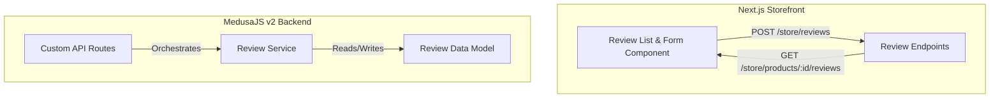

# Client Website Comparison Audit: eggfreecakebreak.com vs. Web App

This audit compares the client's live website ([eggfreecakebreak.com](https://eggfreecakebreak.com/)) with our Next.js storefront and MedusaJS v2 backend workspace. It highlights what features, integrations, and pages are missing or need configuration to ensure feature parity before launch.

---

## 1. Product Selection & Customization

The client's website (built on Magento) allows high-level cake customization. While our storefront provides basic selectors, they are mostly static placeholders and lack backend integration.

### Gaps & Needed Implementation:
*   **Dynamic Sponge Flavor Selection:**
    *   *Client Site:* Dropdown offers Victoria Sponge (default), Chocolate Sponge, and Red Velvet on a per-product basis.
    *   *Our App:* Hardcoded to Vanilla, Chocolate, Red Velvet, and Butterscotch in the frontend. 
    *   *Required:* Link flavor options to Medusa product option values or product-level metadata. Not all cakes support all flavors (e.g. fruit cakes vs chocolate drip cakes).
*   **Variant Size & Serving Coexistence:**
    *   *Client Site:* Cake sizes are selected via inches (8", 10", 12", 14", 16", 18"), displaying approximate servings next to each size (e.g., "10" - approx 15 servings"). The price adjusts instantly per selection.
    *   *Our App:* Size variants are fetched from Medusa options, but "Number of Servings" is a hardcoded select field.
    *   *Required:* Bind servings count directly to specific size variants in Medusa, or calculate servings dynamically using a mapping in the product metadata (e.g. `metadata: { servings: { "8": "6-8", "10": "10-12" } }`).
*   **Personalised Inscription (Message on Cake):**
    *   *Client Site:* Dedicated text input field labeled "Personalised Message" with a character limit of around 100 characters.
    *   *Our App:* Labeled "Special Message" (textarea) and maps to custom attributes, but does not enforce a character limit or distinct layout separating standard decorator messages from general baker notes.
    *   *Required:* Enforce a 100-character limit, style it specifically as a cake inscription input, and structure it separately from "Special Instructions" (200-character limit) so decorators know exactly what text goes on the cake.
*   **Edible Photo Cakes (Image Upload):**
    *   *Client Site:* Features category pages for photo cakes where clients upload or email custom designs.
    *   *Our App:* Missing any file upload component for custom image printing on photo cakes.
    *   *Required:* Create an image upload field (accepting PNG/JPG) for products belonging to the "Photo Cakes" collection. Store the upload securely (e.g., S3/minio) and attach the URL to the cart line item's custom attributes/metadata.
*   **Dynamic Ingredients & Allergen Tags:**
    *   *Client Site:* Displays clear vegetarian (100% egg-free), halal, vegan, and gluten-free tags.
    *   *Our App:* Hardcoded fallback lists for ingredients, allergens, and storage details in the frontend component.
    *   *Required:* Pull ingredients and allergen tags directly from product fields (`material` or custom `product-dietary-tag` relation) and metadata instead of fallbacks.

---

## 2. Product Reviews & Ratings

The client's website includes review management on each product details page, encouraging consumer trust and verification. Our web app currently lacks all review infrastructure.

### Gaps & Needed Implementation:
*   **Data Schema:** No `ProductReview` model in the backend to store reviews, star ratings (1-5), verified purchaser status, review titles, descriptions, and nick-names.
*   **API Endpoints:** Missing:
    *   `GET /store/products/:id/reviews` (fetch approved reviews for a product)
    *   `POST /store/products/:id/reviews` (submit a new review for moderation)
*   **Frontend UI Components:**
    *   Star rating average badge (e.g. `★★★★☆ 4.2 (12 reviews)`) under product titles on catalog cards and detail pages.
    *   Tabbed reviews layout on the product detail page containing customer testimonials.
    *   "Write a Review" interactive form modal prompting users for a nickname, summary, comment, and star rating.

---

## 3. Checkout & Payment Logistics

The current checkout page supports PayPal and a mock "Card" payment which maps to a local cash-on-collection / pay-in-store provider (`pp_system_default`). Real card payment processing and store payout orchestration are missing.

### Gaps & Needed Implementation:
*   **Stripe Connect Payout Splits (Online Cards):**
    *   *Concept:* The database model features a `stripe_connect_account_id` field mapped to physical store locations (`StoreLocation`), but the payment gateway is not configured on the backend.
    *   *Required:* Install and configure `@medusajs/payment-stripe` (or customize the provider to split payouts). When a card payment is authorized on the checkout page, orchestrate the Stripe split payout so that the local bakery branch receives its share directly to its Stripe Connect account.
*   **Time-Slot Availability & Fulfillment Guards:**
    *   *Client Site:* Click & Collect dates and hours are strictly validated.
    *   *Our App:* Basic dropdowns for time-slots (Morning, Afternoon, Evening) and a simple date input.
    *   *Required:* Implement a time-slot builder. Integrate the backend's operating hours and `daily_order_capacity` to show available 30-minute booking slots (e.g. `10:00 - 10:30 AM`), graying out slots once booking capacity is reached.
*   **Delivery Fees & Distance Logic:**
    *   *Client Site:* Delivery parameters and fees are calculated.
    *   *Our App:* Hardcodes a £5 delivery fee if the checkout fulfillment method is set to "delivery".
    *   *Required:* Compute delivery fees dynamically based on driving distance from the selected `StoreLocation` using Google Maps Distance Matrix API or Leaflet routing.

---

## 4. General Pages & Navigation

Our storefront is missing key administrative, informational, and service communication channels that exist on the client's website.

### Gaps & Needed Implementation:
*   **Missing Pages (404 Routes):**
    The header includes links to pages that do not exist in the codebase:
    *   `/about` (About Us page describing the brand, bakeries, and egg-free values)
    *   `/franchise` (Apply Franchise page containing an application form for new store operators)
    *   `/contact` (Contact Us page listing telephone numbers, email links, and an inquiry contact form)
*   **Floating WhatsApp Widget:**
    *   *Client Site:* A fixed green WhatsApp icon widget floats on the bottom right corner, linking directly to the support number `+4407305750164`.
    *   *Our App:* Missing. We need to implement a lightweight floating CSS widget across all storefront pages.
*   **Categories Mega Menu Navigation:**
    *   *Client Site:* A large menu with 23 subcategories (Birthday Round, Birthday Square, Wedding, Vegan, Giant Cookies, etc.) allowing users to drill down fast.
    *   *Our App:* Simple navigation.
    *   *Required:* Update the Header navigation to support a responsive flyout mega menu featuring all product categories.
*   **Cookie Consent Banner (GDPR):**
    *   *Client Site:* Includes a GDPR compliance notice/allow-cookie prompt block.
    *   *Our App:* Missing a dedicated user consent management popover.

---

## Summary Action Checklist

| Category | Task / Feature | Code Location (Target) | Priority |
| :--- | :--- | :--- | :--- |
| **Product** | Dynamic Sponge flavor selections & serving metrics mapped to Medusa variations. | `apps/web/src/modules/product/components/product-detail/` | High |
| **Product** | Image upload field for custom "Photo Cakes". | `apps/web/src/modules/product/components/product-detail/` | Medium |
| **Reviews** | Create `ProductReview` data model, moderation flow, and store APIs. | `apps/backend/src/modules/` & `src/api/store/` | High |
| **Reviews** | Rerender product details and catalog cards to show star ratings and comments list. | `apps/web/src/modules/` | High |
| **Payment** | Stripe Connect gateway backend setup & splits workflow. | `apps/backend/medusa-config.ts` & `apps/backend/src/` | Critical |
| **Payment** | Stripe Elements integration on the checkout page (replacing mock card form). | `apps/web/app/checkout-page/page.tsx` | Critical |
| **Logistics** | Dynamic 30-minute time-slot capacity selector based on store hours. | `apps/web/app/checkout-page/` & `apps/web/app/products/` | High |
| **Logistics** | Distance-based delivery charge calculation (replacing static £5 fee). | `apps/web/src/lib/cart/` & backend shipping profiles | Medium |
| **Static** | Create `/about`, `/franchise`, and `/contact` page routes and components. | `apps/web/app/` (New directories) | High |
| **Layout** | Flyout Category Mega Menu and floating WhatsApp widget. | `apps/web/app/components/Header.tsx` & `Footer.tsx` | Medium |
