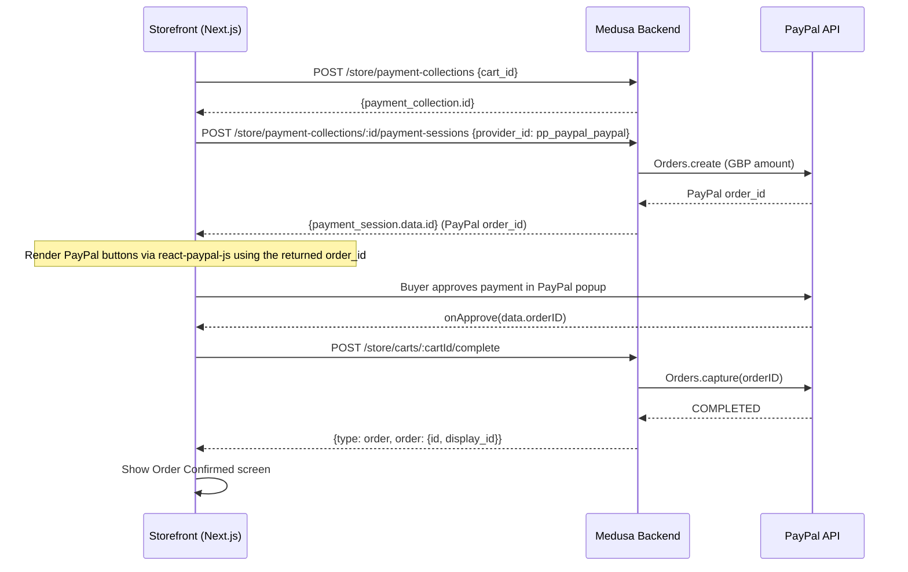

# PayPal Payment Integration (GBP) — Architect Blueprint

## === ARCHITECT HAND-OFF COMPRESSION SNIPPET ===

---

### 1. TARGET GOAL

Integrate PayPal as the first real payment provider for the Cake Break franchise platform (currency: **GBP**), using the `@alphabite/medusa-paypal` community plugin on the backend (Medusa v2.15.3) and `@paypal/react-paypal-js` on the storefront (Next.js 15). **Definition of done**: a customer selects PayPal at checkout → is shown the PayPal button → completes payment → Medusa creates the order with `payment_status: captured` and the storefront shows the "Order Confirmed" screen with a valid `display_id`.

---

### 2. SYSTEM ARCHITECTURE & DATA FLOW



#### Key Components Map

| Layer | Component | Role |
|-------|-----------|------|
| **Backend Config** | [medusa-config.ts](file:///home/rakshit/web%20apps/cake-project/my-franchise-platform/apps/backend/medusa-config.ts) | Register `@alphabite/medusa-paypal` as payment provider under `Modules.PAYMENT` |
| **Backend Env** | `.env` / `.env.docker` | `PAYPAL_CLIENT_ID`, `PAYPAL_CLIENT_SECRET`, `PAYPAL_IS_SANDBOX` |
| **Storefront Env** | `apps/web/.env.local` | `NEXT_PUBLIC_PAYPAL_CLIENT_ID` |
| **Storefront** | `PayPalProvider` wrapper | New component wrapping `PayPalScriptProvider` from `@paypal/react-paypal-js` |
| **Storefront** | [checkout-page/page.tsx](file:///home/rakshit/web%20apps/cake-project/my-franchise-platform/apps/web/app/checkout-page/page.tsx) | Refactor `handleSubmit` to branch on `paymentMethod` — PayPal flow vs legacy system-provider flow |
| **Storefront** | [cart-actions.ts](file:///home/rakshit/web%20apps/cake-project/my-franchise-platform/apps/web/src/lib/cart/cart-actions.ts) | New functions: `initPaymentSession()`, `completeCartOrder()` (decouple from monolithic `placeOrder`) |
| **Admin** | Medusa Admin Dashboard | Add PayPal provider to the GBP Region (manual step or seed script) |

---

### 3. CRITICAL EDGE CASES

> [!CAUTION]
> These are the three highest-risk failure modes — each must be explicitly addressed in implementation.

#### Edge Case 1: PayPal Popup Closed / Abandoned
- **Scenario**: User opens PayPal popup, then closes it without approving.
- **Mitigation**: The `onCancel` callback on `PayPalButtons` must reset the checkout UI to the payment-method selection state **without** calling `/carts/:id/complete`. The payment session remains "pending" — it can be retried or will expire. Show a toast: "Payment was cancelled. You can try again."

#### Edge Case 2: Double-Submit / Race on Cart Complete
- **Scenario**: `onApprove` fires, storefront calls `/carts/:id/complete`, but the user clicks the submit button again (or network retries).
- **Mitigation**:
  - Disable the "Complete Order" button and all PayPal buttons immediately on `onApprove`.
  - Gate `completeCartOrder()` with a local `ref` (`completingRef.current`) to reject concurrent calls.
  - Medusa's `completeCartWorkflow` is idempotent per cart — a second call on an already-completed cart returns `{type:"cart", error}` which the storefront must handle gracefully (redirect to confirmation if order exists).

#### Edge Case 3: Payment Session Provider Mismatch (System vs PayPal)
- **Scenario**: The existing [placeOrder](file:///home/rakshit/web%20apps/cake-project/my-franchise-platform/apps/web/src/lib/cart/cart-actions.ts#L344-L433) function hard-codes `provider_id: "pp_system_default"`. If both providers coexist, the wrong session could be initialized.
- **Mitigation**: The `provider_id` must be passed dynamically based on the selected `paymentMethod` state:
  - `"card"` -> `"pp_system_default"` (placeholder until Stripe is added)
  - `"paypal"` -> `"pp_paypal_paypal"` (the identifier from `@alphabite/medusa-paypal`)
  - The payment collection creation and session init must happen **after** the user selects a method, not before.

---

### 4. EXPLICIT TECH STACK & RULES

| Dependency | Version | Location | Notes |
|------------|---------|----------|-------|
| `@alphabite/medusa-paypal` | `latest` (>=2.0 for Medusa >=2.13) | `apps/backend/package.json` | Provider ID: `pp_paypal_paypal` |
| `@paypal/react-paypal-js` | `^8.x` | `apps/web/package.json` | Provides `PayPalScriptProvider`, `PayPalButtons` |
| `@medusajs/medusa` | `2.15.3` (existing) | — | No upgrade needed |
| Next.js | `^15.3.4` (existing) | — | No upgrade needed |

#### Naming Conventions
- **Provider ID in Medusa config**: `"paypal"` (the `id` field) -> Medusa resolves this as `pp_paypal_paypal`
- **Environment variables**: `PAYPAL_CLIENT_ID`, `PAYPAL_CLIENT_SECRET`, `PAYPAL_IS_SANDBOX` (backend); `NEXT_PUBLIC_PAYPAL_CLIENT_ID` (storefront)
- **Component filenames**: PascalCase (`PayPalCheckoutButton.tsx`, `PayPalProvider.tsx`)
- **Action functions**: camelCase (`initPaymentSession`, `completeCartOrder`)

#### Rules
1. **Do NOT remove** the `pp_system_default` flow — it remains the fallback for "pay on collection" / card placeholder. Both providers coexist.
2. **Currency is GBP**. The PayPal integration must pass `currency: "GBP"` in its config. All storefront formatting already uses `en-GB` / `GBP` (see [fmt()](file:///home/rakshit/web%20apps/cake-project/my-franchise-platform/apps/web/app/checkout-page/page.tsx#L19-L25)).
3. **PayPal sandbox first**. Set `PAYPAL_IS_SANDBOX=true` in all dev/docker envs. Only flip to `false` for production.
4. **Region setup required**. The PayPal provider must be added to the GBP Region in Medusa Admin -> Settings -> Regions -> UK -> Payment Providers. This can be scripted in the seed or done manually.
5. **No DB migrations needed** — `@alphabite/medusa-paypal` is a pure payment provider module, not a data-model module.

---

### 5. STEP-BY-STEP IMPLEMENTATION PLAN

#### Phase A: Backend — PayPal Provider Registration

##### Step A1: Install `@alphabite/medusa-paypal`
```bash
cd apps/backend && npm install @alphabite/medusa-paypal
```

##### Step A2: Add env vars
Add to `.env.docker`, `.env` (local), and any production env:
```env
PAYPAL_CLIENT_ID=<sandbox_client_id>
PAYPAL_CLIENT_SECRET=<sandbox_client_secret>
PAYPAL_IS_SANDBOX=true
```

##### Step A3: Register provider in medusa-config.ts
Add to the `modules` record (alongside `franchise`, `dietary_tag`):
```typescript
import { Modules } from '@medusajs/framework/utils'

// Inside the modules object:
[Modules.PAYMENT]: {
  resolve: "@medusajs/medusa/payment",
  options: {
    providers: [
      {
        resolve: "@alphabite/medusa-paypal",
        id: "paypal",
        options: {
          clientId: process.env.PAYPAL_CLIENT_ID,
          clientSecret: process.env.PAYPAL_CLIENT_SECRET,
          isSandbox: process.env.PAYPAL_IS_SANDBOX === "true",
        },
      },
    ],
  },
},
```

##### Step A4: Region Configuration
After backend restart, add the PayPal provider (`pp_paypal_paypal`) to the UK/GBP region via:
- Medusa Admin -> Settings -> Regions -> (GBP region) -> Payment Providers -> Enable PayPal
- **OR** add to [initial-data-seed.ts](file:///home/rakshit/web%20apps/cake-project/my-franchise-platform/apps/backend/src/migration-scripts/initial-data-seed.ts) if scripted

##### Step A5: Verify
Restart backend (`npm run dev`). Check `GET /admin/payment-providers` — `pp_paypal_paypal` should appear.

---

#### Phase B: Storefront — PayPal Button Integration

##### Step B1: Install `@paypal/react-paypal-js`
```bash
cd apps/web && npm install @paypal/react-paypal-js
```

##### Step B2: Add storefront env var
Add to `apps/web/.env.local`:
```env
NEXT_PUBLIC_PAYPAL_CLIENT_ID=<same_sandbox_client_id>
```

##### Step B3: Create `PayPalProvider.tsx`
**File**: `apps/web/app/components/PayPalProvider.tsx`
- Wraps children with `PayPalScriptProvider` using `NEXT_PUBLIC_PAYPAL_CLIENT_ID`, `currency: "GBP"`, `intent: "capture"`
- `"use client"` directive required

##### Step B4: Create `PayPalCheckoutButton.tsx`
**File**: `apps/web/app/components/PayPalCheckoutButton.tsx`
- Renders `PayPalButtons` with `style={{ layout: "vertical", color: "blue", shape: "rect", label: "paypal" }}`
- Props: `cartId`, `paymentCollectionId`, `onSuccess(order)`, `onError(err)`, `onCancel()`
- `createOrder` callback: calls Medusa to init payment session -> returns the `data.id` (PayPal order ID)
- `onApprove` callback: calls `/store/carts/:cartId/complete` -> invokes `onSuccess` with the Medusa order
- `onCancel` callback: resets UI state
- `onError` callback: shows error toast

##### Step B5: Refactor cart-actions.ts
Decompose the monolithic `placeOrder()` into composable steps:
1. `prepareCartForCheckout(cartId, details)` — saves contact, address, notes, attaches shipping method (steps 1-2 of current `placeOrder`)
2. `createPaymentCollection(cartId)` — step 3a
3. `initPaymentSession(paymentCollectionId, providerId)` — step 3b (provider_id is now dynamic)
4. `completeCartOrder(cartId)` — step 4
5. Keep the old `placeOrder()` as a convenience wrapper that chains all four with `pp_system_default` for backward compat

##### Step B6: Refactor checkout-page/page.tsx
- Wrap the checkout page (or layout) with `PayPalProvider`
- When `paymentMethod === "paypal"`:
  - On form submit: call `prepareCartForCheckout()` + `createPaymentCollection()` first
  - Then **show the PayPal buttons** (not a form submit button) — the `PayPalCheckoutButton` calls `initPaymentSession("pp_paypal_paypal")` inside its `createOrder` callback
  - On PayPal approval: `completeCartOrder()` is called -> order confirmation screen
- When `paymentMethod === "card"`:
  - Keep existing `placeOrder()` flow (system default provider)
- The "Complete Order & Pay" button should morph into the PayPal button area when PayPal is selected

##### Step B7: UI Polish
- PayPal button area should match the "Modern Confectionery" design system:
  - Wrap in a styled container with the same rounded corners, border, and padding as the card fields
  - Add a loading skeleton while the PayPal SDK initializes
  - Disable the native submit button when PayPal is selected (prevent double submission)

---

#### Phase C: Testing & Verification

| Test | Method | Expected Result |
|------|--------|-----------------|
| Provider appears in admin | `GET /admin/payment-providers` (authenticated) | `pp_paypal_paypal` in response |
| PayPal sandbox checkout | Full storefront E2E | Order created with `payment_status: captured` |
| Cancel mid-flow | Close PayPal popup | UI resets, no orphaned order |
| System default still works | Select "Credit/Debit Card" | Order created via `pp_system_default` |
| GBP amounts correct | Check PayPal sandbox dashboard | Amount matches cart total in GBP |
| Docker env works | `docker compose up` | Backend loads PayPal provider without errors |

---

## Open Questions

> [!IMPORTANT]
> **PayPal Sandbox Credentials**: Do you already have PayPal sandbox app credentials (client ID + secret)? If not, you'll need to create them at [developer.paypal.com](https://developer.paypal.com/dashboard/applications/sandbox) before implementation can proceed.

> [!IMPORTANT]
> **Region Setup**: Does your Medusa instance already have a GBP Region configured? The PayPal provider needs to be attached to this region. If no GBP region exists yet, one must be created first (Settings -> Regions -> Add Region -> Currency GBP, Country GB).

> [!NOTE]
> **Card Payments**: The current "Credit/Debit Card" option uses `pp_system_default` (pay on collection). When do you plan to integrate a real card processor (e.g., Stripe)? This determines whether we should remove/hide the card option now or keep it as-is.
